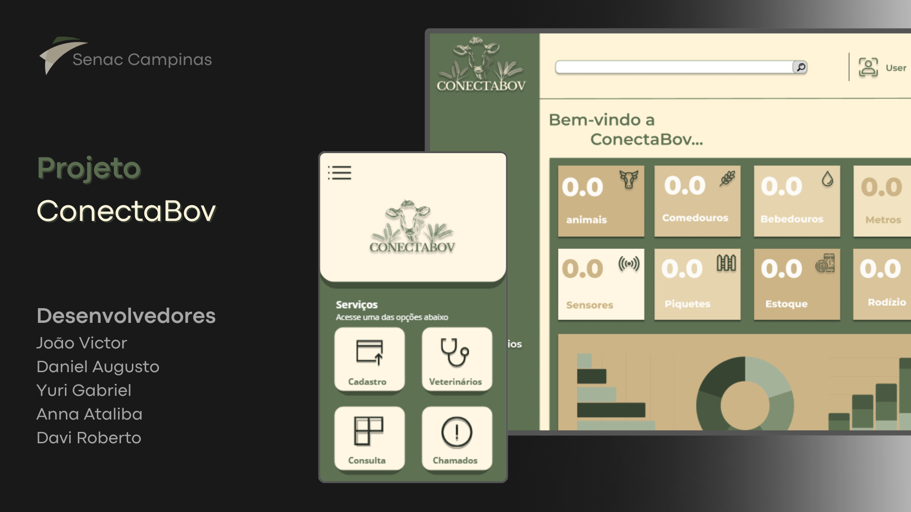

<h1 align="center">Projeto ConectaBov</h1>

  Projeto Integrador desenvolvido com a proposta para o Senac Campinas

  <a href="#-tecnologias">Tecnologias</a>&nbsp;&nbsp;&nbsp;|&nbsp;&nbsp;&nbsp;
  <a href="#-projeto">Projeto</a>&nbsp;&nbsp;&nbsp;|&nbsp;&nbsp;&nbsp;
  <a href="#-layout">Layout</a>&nbsp;&nbsp;&nbsp;|&nbsp;&nbsp;&nbsp;
   <a href="#funcionalidades">Funcionalidades</a>

  

 

## 🚀 Tecnologias

Esse projeto foi desenvolvido com as seguintes tecnologias:

- 🌐 HTML 
- 🎨 CSS 
- ⚙️ JavaScript
- 🔧 Git 
- 🐱 GitHub
- 🖌️ Figma

## 💻 Projeto

A ConectaBov surgiu como uma proposta de avanço no setor pecuário, sendo um site focado na centralização e tratamento de dados voltados à gestão e produtividade no campo.

## 🎨 Layout

O layout foi desenvolvido no Figma e está disponível [aqui](https://www.figma.com/design/Crtni8Cp3H1taxwYU4Ivn2/Projeto-integrador-UC---16?node-id=33-2&t=832eXJNOAVPOGbTy-1).

## 🛠️ Funcionalidades
- 📊 Visualização de dados
- 📋 Cadastro de animais
- 🧑‍⚕️ Consulta de veterinários
- 🚨 Sistema de chamados
---

## 👥 Equipe

Projeto desenvolvido por:

- [João Victor](https://github.com/Johnizidro)
- [Davi Roberto](https://github.com/Davi-git1)
- [Yuri Gabriel](https://github.com/yuri522)
- [Daniel Santos](https://github.com/dasantos2)

---

Feito com ♥ por todos os integrantes do ConectaBov

